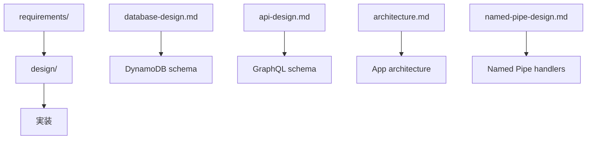

# 設計書

## 概要

このディレクトリには、Hedge Systemの設計書が格納されています。要件定義に基づいて、システムの具体的な設計・アーキテクチャ・実装方針を定義しています。

## ファイル構成

```
design/
├── README.md              # このファイル
├── database-design.md     # データベース設計
├── api-design.md          # GraphQL API設計
├── architecture.md        # システムアーキテクチャ
└── named-pipe-design.md   # Named Pipe通信設計
```

## 設計原則

### MVP準拠設計
- **シンプルさ最優先**: 複雑な設計パターンは避ける
- **YAGNI原則**: 将来の拡張性は考慮しない
- **実用性重視**: 理論的完璧さより実用的解決策を選択

### 技術制約
- **Monorepo構成**: Turborepo + pnpm workspaces
- **AWS Amplify Gen2**: GraphQL API・認証・データベース
- **Tauri v2**: デスクトップアプリケーション
- **TypeScript strict**: 型安全性の確保

## 設計書の関係



## 読む順序

設計書を理解するための推奨読書順序：

1. **architecture.md** - システム全体のアーキテクチャを把握
2. **database-design.md** - データモデルとリレーションを理解
3. **api-design.md** - GraphQL APIの設計を確認
4. **named-pipe-design.md** - リアルタイム通信の実装方針を確認

## 実装との対応

| 設計書 | 対応する実装 | 責任範囲 |
|-------|------------|---------|
| `database-design.md` | Amplify schema定義 | データモデル・リレーション |
| `api-design.md` | GraphQLクエリ・ミューテーション | API仕様・型定義 |
| `architecture.md` | Tauriアプリ構成 | コンポーネント構成・責任分担 |
| `named-pipe-design.md` | Named Pipeハンドラ | リアルタイム通信プロトコル |

## 設計変更プロセス

### 変更時の確認事項
1. **要件との整合性**: requirements/との対応確認
2. **MVP制約遵守**: 複雑化していないか確認
3. **技術制約**: 使用技術の制約範囲内か確認
4. **実装可能性**: 実装時間・複雑度の妥当性確認

### 承認フロー
- **データベース設計変更**: マイグレーション影響確認必須
- **API設計変更**: クライアント・サーバー両方の影響確認必須
- **アーキテクチャ変更**: 全体影響分析必須

## アーキテクチャ原則

### データフロー
```
EA(MT4/MT5) → Named Pipe → Tauri App → GraphQL → DynamoDB
                ↓
            Admin Web App ← GraphQL ← DynamoDB
```

### 責任分離
- **EA**: 取引実行・価格データ送信
- **Tauri App**: Named Pipe管理・ローカル状態管理
- **GraphQL API**: データ永続化・認証・認可
- **Admin Web**: ユーザー操作・設定管理

## 品質保証

### 設計レビュー観点
- [ ] MVP制約に抵触していないか
- [ ] 技術的負債を生まない設計か
- [ ] 保守性・可読性が確保されているか
- [ ] セキュリティ要件を満たしているか
- [ ] パフォーマンス要件を満たしているか

## 参照

- 要件定義: `../requirements/README.md`
- MVP制約: `../mvp-constraints/README.md`
- 実装ガイド: `../guides/README.md`