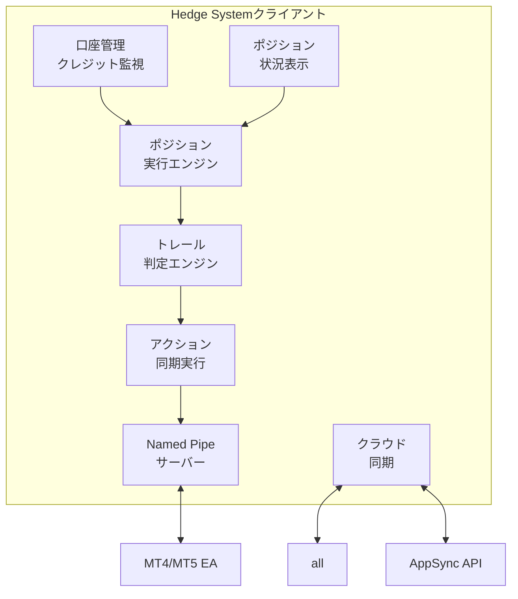
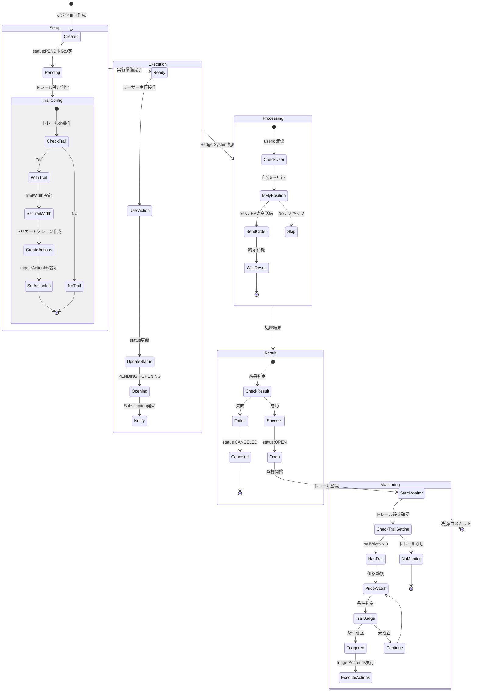
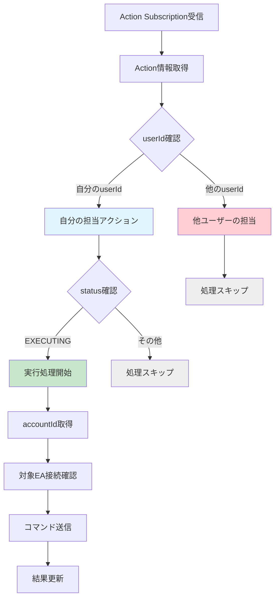
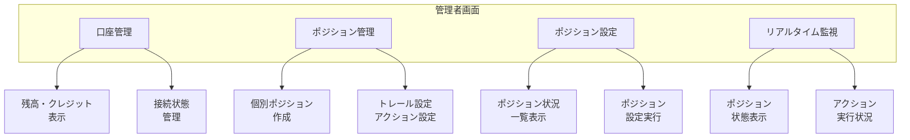

## 5. システムアーキテクチャ詳細

### 5-1. Hedge Systemクライアント（Tauriアプリ）

主要機能：

1. **口座管理**

   - 接続中の口座情報管理
   - 残高・クレジット・証拠金の定期更新
   - クレジット変動の監視
   - userIdによる所有者特定

2. **ポジション実行エンジン**

   - 個別ポジションの実行管理
   - ポジションステータスの遷移管理
   - userIdベースの実行判定

3. **ポジション管理支援**

   - 口座全体のポジション状況表示
   - 人間が判断した両建て設定の実行
   - ネットポジションの計算・表示
   - クレジット活用状況の可視化

4. **トレール判定エンジン**
   - トレール設定を持つ全ポジションの監視
   - 各ポジション独立したトレール条件判定
   - triggerActionIdsの実行管理

### 5-2. ポジション実行フロー

### 5-3. アクション実行の担当判定フロー

### 5-4. 管理者画面（Next.js）

**主要機能：**

1. **口座管理**

   - 残高・クレジット・証拠金の表示
   - クレジット変動履歴
   - 口座接続状態

2. **ポジション管理**

   - 個別ポジション作成・実行
   - トレール設定（任意のポジションに設定可能）
   - アクション管理

3. **ポジション管理**
   - 口座全体の俯瞰表示
   - ネットポジション表示
   - 人間が決定したポジション設定の実行
   - クレジット活用状況の確認

