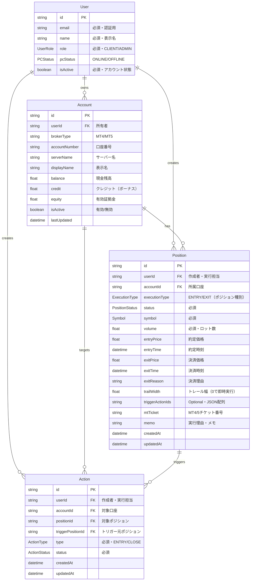

## 2. データベース設計

### 2-1. データモデル全体図（userId最適化版）

### 2-2. userId追加による最適化効果

| 改善項目                  | 説明                            | クエリ例（GSI使用）                                                       |
| ------------------------- | ------------------------------- | ------------------------------------------------------------------------- |
| **1. 高速な担当判定**     | userIdのGSIで直接検索           | `listPositionsByUserId(userId: "user-123", limit: 100)`                   |
| **2. 実行対象の即座判定** | Account経由せずに判定可能       | `listActionsByUserIdAndStatus(userId: $myUserId, statusEq: "EXECUTING")`  |
| **3. 監視対象の効率化**   | 自分のトレール対象のみ監視      | `listPositionsByUserId(userId: $myUserId, filter: {trailWidth: {gt: 0}})` |
| **4. ユーザー別集計**     | GSI使用でユーザー単位の高速集計 | `listPositionsByUserIdAndStatus(userId: $userId, statusEq: "OPEN")`       |

### 2-3. 列挙型（Enum）定義

| 列挙型名           | 値                             | 説明                                 |
| ------------------ | ------------------------------ | ------------------------------------ |
| **Symbol**         | USDJPY, EURUSD, EURGBP, XAUUSD | 取引可能な銘柄                       |
| **PositionStatus** | PENDING                        | 作成済み・発注待機中                 |
|                    | OPENING                        | 発注処理中（実行開始後）             |
|                    | OPEN                           | エントリー約定済み・ポジション保有中 |
|                    | CLOSING                        | 決済指令済みでクローズ処理中         |
|                    | CLOSED                         | ポジション決済済み                   |
|                    | STOPPED                        | ロスカット執行済み                   |
|                    | CANCELED                       | 発注失敗等でポジション不成立         |
| **ActionType**     | ENTRY                          | 新規エントリー                       |
|                    | CLOSE                          | 通常クローズ                         |
| **ExecutionType**  | ENTRY                          | エントリー実行（新規ポジション作成） |
|                    | EXIT                           | 決済実行（既存ポジション決済）       |
| **ActionStatus**   | PENDING                        | アクション待機中                     |
|                    | EXECUTING                      | 実行中                               |
|                    | EXECUTED                       | 実行完了                             |
|                    | FAILED                         | 実行失敗                             |
| **UserRole**       | CLIENT                         | 一般ユーザー                         |
|                    | ADMIN                          | 管理者                               |
| **PCStatus**       | ONLINE                         | PC接続中                             |
|                    | OFFLINE                        | PC未接続                             |

**注記：ExecutionTypeとActionTypeの違い**
- **ExecutionType**: Positionの種別を示す（そのポジションがエントリー用か決済用か）
- **ActionType**: Actionが実行する操作の種別を示す（新規エントリーか既存ポジション決済か）

### 2-4. 認証・権限設計

各モデルの権限設定：

- **User**: 本人は読み取り・更新可、ADMINロールは全操作可
- **Account**: 所有者とADMINは全操作可
- **Position/Action**: userIdベースでの所有者とADMINグループは全操作可

