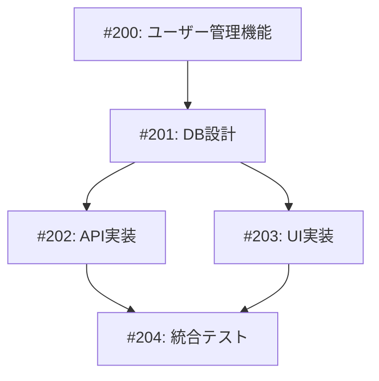

# 実例4: 並列開発の実例

## 📋 背景

ユーザー管理機能を実装する必要があり、フロントエンドとバックエンドを別々のチームが並列で開発することになりました。

## 🎯 イシュー構成

### 親イシュー
**Issue #200: ユーザー管理機能の実装**

### 並列実行される子イシュー



## 📝 各イシューの詳細

### Issue #201: データベース設計
```markdown
## タスク概要
ユーザー管理のためのデータベーススキーマ設計

## 担当: Backend Team A
## ブランチ: issue-201-user-db-schema

## 完了条件
- [ ] Userテーブルの設計
- [ ] マイグレーションファイル作成
- [ ] 基本的なシードデータ
```

### Issue #202: API実装
```markdown
## タスク概要
ユーザー管理APIエンドポイントの実装

## 担当: Backend Team B
## ブランチ: issue-202-user-api
## 依存: #201

## 完了条件
- [ ] CRUD操作のエンドポイント
- [ ] 認証・認可の実装
- [ ] APIドキュメント作成
```

### Issue #203: UI実装
```markdown
## タスク概要
ユーザー管理画面の実装

## 担当: Frontend Team
## ブランチ: issue-203-user-ui
## 依存: #201 (スキーマ定義のみ)

## 完了条件
- [ ] ユーザー一覧画面
- [ ] ユーザー編集フォーム
- [ ] モックデータでの動作確認
```

## 🚀 並列開発の実装

### Day 1: 開発開始

**Backend Team A (#201)**
```typescript
// packages/backend/prisma/schema.prisma
model User {
  id        String   @id @default(cuid())
  email     String   @unique
  name      String
  role      UserRole @default(USER)
  createdAt DateTime @default(now())
  updatedAt DateTime @updatedAt
}

enum UserRole {
  USER
  ADMIN
}
```

**Frontend Team (#203) - 同時進行**
```typescript
// apps/web/types/user.ts
// DBスキーマと同期を取りながら型定義
export interface User {
  id: string;
  email: string;
  name: string;
  role: 'USER' | 'ADMIN';
  createdAt: string;
  updatedAt: string;
}

// モックデータで開発
const mockUsers: User[] = [
  {
    id: '1',
    email: 'user@example.com',
    name: 'Test User',
    role: 'USER',
    createdAt: '2024-01-01',
    updatedAt: '2024-01-01',
  },
];
```

### Day 2: API実装とUI実装の並列作業

**Backend Team B (#202)**
```typescript
// packages/backend/src/routes/users.ts
import { Router } from 'express';
import { prisma } from '../lib/prisma';

const router = Router();

// GET /api/users
router.get('/', async (req, res) => {
  const users = await prisma.user.findMany({
    select: {
      id: true,
      email: true,
      name: true,
      role: true,
      createdAt: true,
      updatedAt: true,
    },
  });
  res.json(users);
});

// POST /api/users
router.post('/', async (req, res) => {
  const { email, name, role } = req.body;
  const user = await prisma.user.create({
    data: { email, name, role },
  });
  res.json(user);
});
```

**Frontend Team (#203) - 継続**
```tsx
// apps/web/app/users/page.tsx
'use client';

import { useState, useEffect } from 'react';
import { UserList } from '@/components/users/user-list';
import { useMockData } from '@/hooks/use-mock-data';

export default function UsersPage() {
  const { users, loading } = useMockData(); // 開発中はモック使用

  return (
    <div className="container mx-auto p-4">
      <h1 className="text-2xl font-bold mb-4">ユーザー管理</h1>
      {loading ? (
        <div>読み込み中...</div>
      ) : (
        <UserList users={users} />
      )}
    </div>
  );
}
```

### Day 3: 統合準備

**API/UIの接続準備**
```typescript
// apps/web/lib/api/users.ts
const API_URL = process.env.NEXT_PUBLIC_API_URL || 'http://localhost:3001';

export const userApi = {
  async getAll(): Promise<User[]> {
    // 開発モードではモックを返す
    if (process.env.NODE_ENV === 'development' && !process.env.USE_REAL_API) {
      return mockUsers;
    }
    
    const res = await fetch(`${API_URL}/api/users`);
    return res.json();
  },
  
  async create(data: CreateUserDto): Promise<User> {
    const res = await fetch(`${API_URL}/api/users`, {
      method: 'POST',
      headers: { 'Content-Type': 'application/json' },
      body: JSON.stringify(data),
    });
    return res.json();
  },
};
```

## 🔄 マージ戦略

### 1. スキーマ定義を最初にマージ (#201)
```bash
git checkout main
git merge issue-201-user-db-schema
```

### 2. API実装とUI実装を同時にマージ可能に
```bash
# APIチームのPR
git checkout issue-202-user-api
git merge main  # 最新のスキーマを取り込む
# PR作成

# UIチームのPR（同時進行）
git checkout issue-203-user-ui
git merge main  # 最新のスキーマを取り込む
# PR作成
```

### 3. 統合ブランチで結合テスト
```bash
git checkout -b issue-204-integration
git merge issue-202-user-api
git merge issue-203-user-ui
# 統合テスト実施
```

## ✅ 結果

### タイムライン
- Day 1: #201（スキーマ）開始、#203（UI）開始
- Day 2: #201 完了・マージ、#202（API）開始
- Day 3: #202, #203 完了
- Day 4: #204（統合）完了

**従来の直列開発: 約8日**
**並列開発: 4日（50%短縮）**

## 💡 学び

### 成功要因
1. **明確な境界** - API仕様を事前に定義
2. **モックの活用** - フロントエンドが独立して開発
3. **型の共有** - TypeScriptで型定義を共有
4. **段階的統合** - 小さな単位でマージ

### 注意点
1. **仕様変更の影響** - 並列作業中の仕様変更は影響大
2. **コミュニケーション** - チーム間の密な連携が必要
3. **統合テスト** - 個別には動いても統合で問題が出ることも

### ベストプラクティス
- インターフェースを先に定義
- モックとスタブを積極的に活用
- 定期的な同期ミーティング
- 早めの統合テスト