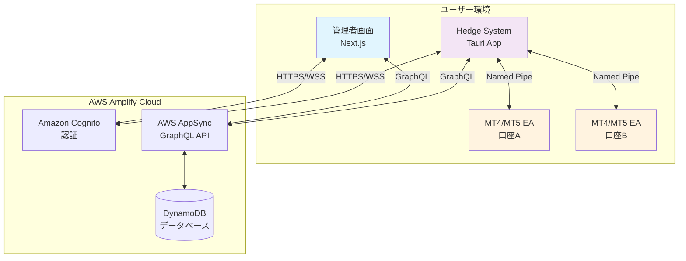

# AWS Amplifyベース Hedge System MVP システム設計書 v7.0

## 1. システム概要

### 1-1. システムの目的

本システムは、ボーナスアービトラージ業務向けの**ポジション管理型自動取引システム**（Hedge System）です。複数のMT4/MT5口座を一元管理し、人間のトレーダーが判断した両建て戦略に基づいて、管理者画面からポジション設定を行い、クレジット（ボーナス）を活用した取引を実行します。システムは自動で両建てを管理するのではなく、人間が設定したポジション計画を忠実に実行する役割を担います。1ユーザー1PCの制約のもと、シンプルで確実な取引実行を実現します。

### 1-2. システム構成要素

### 1-3. 主要機能（MVP範囲）

- **口座管理**: MT4/MT5の複数口座情報とクレジット（ボーナス）管理（管理画面から作成）
- **ポジション管理**: エントリー・決済・トレール設定を個別管理（全て管理画面から作成）
- **ポジション管理**: 人間が判断・設定した両建て戦略に基づくポジション実行
- **トレーリングストップ**: トレール設定を持つポジションが独立してアクション実行
- **ロスカット対応**: ポジションのトレール設定からトリガーされる自動アクション実行
- **リアルタイム監視**: ポジション状態とアクション実行状況のモニタリング
- **シンプルな実行判定**: 1ユーザー1PC制約による確実な処理

### 1-4. システムの基本方針（重要）

本システムにおける重要な基本方針を以下に明記します：

**ポジション管理が主目的**
- システムの主要な役割は、人間が設定したポジション計画を忠実に実行すること
- ロット数、エントリー・決済タイミング、トレール設定などは全て人間が判断・設定
- システムは設定された内容を正確に実行し、その実行状況を可視化する

**両建て管理は人間が行う**
- 両建て戦略の立案、ポジションの組み合わせ判断は人間（トレーダー）が行う
- システムは両建てを自動で維持したり、自動で組み替えたりすることはない
- システムは現在のポジション状況を表示し、人間の判断を支援する情報を提供するのみ

**システムの役割**
1. **実行支援**: 人間が設定したポジション計画の正確な実行
2. **状況表示**: 現在のポジション状況、ネットポジション、クレジット活用状況の可視化
3. **トレール機能**: 設定されたトレール条件に基づく自動実行（条件は人間が設定）
4. **連携機能**: 複数口座間での協調的な実行（実行内容は人間が事前設定）

この基本方針により、システムは「自動取引システム」ではなく「ポジション管理実行支援システム」として機能します。

