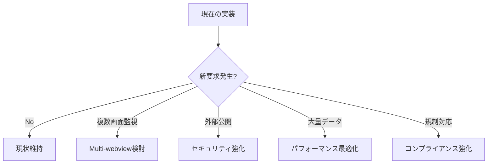

# Tauri V2 実装分析 - 統合評価レポート

## 🎯 総合評価

**Hedge SystemのTauri V2実装は、MVP要求を満たす適切なレベルで実装されている。**

基本的なV2適合性は達成されており、現在の用途（MT4/MT5連携取引システム監視）には十分である。

## 📚 ドキュメント構成

### 📊 分析結果（現在の実装評価）
| 分野 | ドキュメント | 概要 |
|------|-------------|------|
| プラグイン | [Plugin Architecture](./analysis/plugin-architecture.md) | 依存関係・初期化の分析 |
| セキュリティ | [Permissions & Security](./analysis/permissions-security.md) | 権限・CSP設定の評価 |
| UI/API | [Window & WebView API](./analysis/window-webview-api.md) | ウィンドウ管理・イベント処理 |
| 設定 | [Configuration](./analysis/configuration-best-practices.md) | 設定ファイル・最適化 |
| 通信 | [Named Pipe Implementation](./analysis/named-pipe-implementation.md) | MT4/MT5連携の実装分析 |

### 📖 実装ガイド（一般的な実装方法）
| ガイド | 対象 | 概要 |
|--------|------|------|
| [Tauri Rust実装](./guides/tauri-rust-implementation.md) | 基本実装 | エラー対処・パターン |
| [Windows API Rust](./guides/windows-api-rust.md) | Windows特化 | API使用・設定方法 |
| [Named Pipe実装](./guides/named-pipe-implementation.md) | プロセス間通信 | 基本的な実装パターン |

## 🔗 使い方
1. **新規実装**: [実装ガイド](./guides/)から開始
2. **現状理解**: [分析結果](./analysis/)で現在の実装を確認
3. **改善検討**: 各分析の改善提案を参照

## 📊 分野別適合度評価

| 分野 | 適合度 | MVP評価 | 現状 |
|------|--------|---------|------|
| Plugin Architecture | 85% | ✅ 適切 | V2移行完了、正常動作中 |
| Permissions & Security | 75% | ✅ 適切 | 内部通信として十分なレベル |
| Window & WebView API | 85% | ✅ 適切 | ユーザー要求機能を完全実装 |
| Configuration | 80% | ✅ 適切 | 基本設定で要求機能満足 |
| Named Pipe Implementation | 85% | ✅ 適切 | MT4/MT5連携が安定動作 |

**総合適合度: 82%**

## ✅ 現在の実装の価値

### 機能的完成度
- ✅ **MT4/MT5連携**: 複数EA接続、リアルタイム通信が正常動作
- ✅ **UI/UX**: 直感的なメニューシステム、適切なウィンドウ設定
- ✅ **安定性**: エラーハンドリング完備、長期稼働対応
- ✅ **保守性**: 理解しやすいコード構造、適切なAPI使用

### Tauri V2適合性
- ✅ **コア機能**: Tauri 2.5.0、V2プラグインアーキテクチャ採用
- ✅ **API使用**: WebView Window API、Menu Builder、Event System適切に使用
- ✅ **権限管理**: Capabilities Systemによる最小権限実装
- ✅ **非推奨API**: V1の古いパターンは使用されていない

## 🔄 改善時期の指針

### 即座対応
**なし** - 現在の実装で要求機能は満足されている

### 機能拡張時に検討
- **複数画面監視要求時**: Multi-webview導入検討
- **外部公開時**: CSP設定強化、Named Pipe認証実装
- **大量データ転送要求時**: Raw Payload、バイナリプロトコル検討
- **規制・セキュリティ要求変化時**: セキュリティ強化実装

### 長期戦略
- **新技術活用**: Tauri V2新機能への段階的移行
- **プラットフォーム最適化**: 具体的要求発生時の対応
- **アーキテクチャ進化**: IPC Channels、カスタムプロトコル検討

## 📋 MVP制約適合性

### 3つの判断基準クリア

1. **今すぐ必要か？**
   - ✅ 現在の実装で要求機能は満たされている
   - ✅ 追加実装の緊急性は低い

2. **最小限の実装か？**
   - ✅ 複雑化を避けた適切な実装レベル
   - ✅ 過剰な機能追加なし

3. **価値を提供しているか？**
   - ✅ ユーザーに直接的価値を提供
   - ✅ 取引システム監視の基本機能完備

## 🛠️ 実装推奨事項

### 現状維持（推奨）
現在の実装を継続使用し、以下の保守のみを実施：

1. **依存関係更新**: 定期的なTauriプラグインのセキュリティ更新
2. **ログ監視**: 動作状況の継続監視
3. **ドキュメント保守**: 実装ドキュメントの最新化

### 将来の拡張指針

## 📚 ドキュメント構成

### 分析結果
- **[analysis/plugin-architecture.md](./analysis/plugin-architecture.md)** - プラグインシステム分析
- **[analysis/permissions-security.md](./analysis/permissions-security.md)** - セキュリティ・権限設定分析
- **[analysis/window-webview-api.md](./analysis/window-webview-api.md)** - ウィンドウ・WebView API分析
- **[analysis/configuration-best-practices.md](./analysis/configuration-best-practices.md)** - 設定・ベストプラクティス分析
- **[analysis/named-pipe-implementation.md](./analysis/named-pipe-implementation.md)** - Named Pipe実装分析

### 実装ガイド
- **[guides/](./guides/)** - Tauri実装の実践的ガイド集

## 🎯 結論

**現在のHedge SystemのTauri V2実装は、MVP原則に従った適切な状態にある。**

- **技術的品質**: 高い適合度（82%）でV2ベストプラクティスを実装
- **実用性**: ユーザー要求機能を完全に満たしている
- **保守性**: 理解しやすく、保守しやすい実装
- **拡張性**: 将来の要求変化に対する適切な拡張指針を確立

追加実装は実際の要求変化に応じて段階的に検討することで、MVP原則に従った効率的な開発が継続可能である。

---

**最終更新**: 2025-07-15  
**次回見直し**: 機能要求変化時または半年後