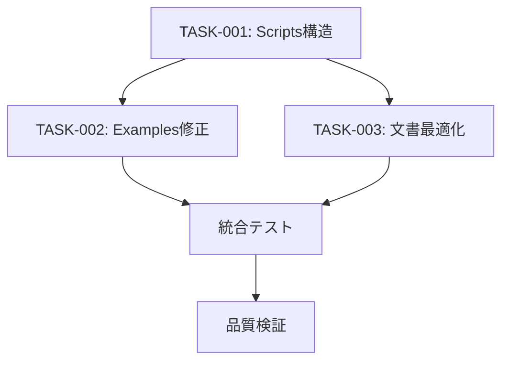

# 🎯 TradingAssistantX 品質改善プロジェクト

## 📋 プロジェクト概要

**目的**: ディレクトリ構成の問題を解決し、システム全体の品質を向上させる

**識別された主要課題**:
1. **scripts/重複構造** - `/scripts/` と `/src/scripts/` の混乱
2. **examples/参照エラー** - 存在しないファイルへの参照
3. **文書過多問題** - 冗長で保守困難な文書

## 🎯 実行戦略

### Phase 1: 構造改善 (TASK-001)
**優先度: 🔴 最高**
```
scripts/重複構造を解消
├── /scripts/ → /tools/ へリネーム
├── 参照パス全体の更新  
└── 明確な責任分離確立
```

### Phase 2: 実用性改善 (TASK-002)
**優先度: 🟡 高**
```
examples/を実際に動作するコードに修正
├── 不正なインポート修正
├── 存在しないファイル参照削除
└── 実用的なサンプルコード作成
```

### Phase 3: 文書最適化 (TASK-003)  
**優先度: 🟢 中**
```
冗長な文書を簡潔化
├── README.md を361行→50行に削減
├── 重複・不正確な情報削除
└── 品質チェック機能追加
```

## 📋 実行順序と依存関係



**重要**: TASK-001完了後にTASK-002, TASK-003を並行実行可能

## 🛠️ Worker向け実行ガイド

### 事前準備
```bash
# 1. 権限確認
echo "ROLE: $ROLE" && git branch --show-current
# Worker権限であることを確認

# 2. 作業前バックアップ
git stash push -m "品質改善作業前バックアップ"

# 3. 依存関係確認
pnpm install
pnpm run dev  # 現在の動作確認
```

### 各タスク実行

#### TASK-001実行
```bash
# 1. 指示書確認
cat tasks/20250722_160143_quality_improvement/instructions/TASK-001-scripts-structure-reorganization.md

# 2. 実行前テスト
tools/quality-check.sh  # 現状把握

# 3. タスク実行
# (詳細は TASK-001 に記載)

# 4. 検証
pnpm run dev
tools/quality-check.sh
```

#### TASK-002実行  
```bash
# 1. TASK-001完了確認必須

# 2. 実在ファイル調査
find src -name "*performance*" -type f

# 3. タスク実行
# (詳細は TASK-002 に記載)

# 4. 動作確認
tsx examples/performance-monitoring-usage.ts
```

#### TASK-003実行
```bash
# 1. 現状文書量確認
wc -l examples/README.md docs/*.md

# 2. タスク実行
# (詳細は TASK-003 に記載)

# 3. 品質確認
tools/doc-validator.sh  # 新規作成ツール
```

## ✅ 完了条件チェックリスト

### 🏗️ 構造改善
- [ ] `/scripts/`ディレクトリが`/tools/`にリネーム済み
- [ ] 全参照パスが正しく更新されている  
- [ ] `pnpm run dev`がエラーなく実行される

### 🔧 機能改善  
- [ ] `tsx examples/performance-monitoring-usage.ts`が正常実行
- [ ] 全インポートエラーが解消されている
- [ ] TypeScript/ESLint エラーがない

### 📚 文書品質
- [ ] `examples/README.md`が50行以下
- [ ] 不正なファイル参照が0件
- [ ] 文書品質チェック機能が動作

### 🧪 統合テスト
- [ ] システム全体が正常動作
- [ ] 既存機能への影響なし
- [ ] パフォーマンス劣化なし

## 🚨 リスク管理

### 高リスク項目
1. **package.json変更**: scripts設定は変更禁止
2. **src/scripts/への影響**: エントリポイントの保護
3. **既存機能破壊**: 慎重な段階的変更

### 回復手順
```bash
# 問題発生時の回復
git stash pop  # バックアップ復元
git checkout HEAD~1  # 直前状態に戻る
pnpm install  # 依存関係再構築
```

### エスカレーション条件
- システム起動不能
- 既存テストの大量失敗
- 予期しない動作変更

→ **即座にManager権限者に報告**

## 📊 成功指標

### 量的指標
| 項目 | Before | Target | 測定方法 |
|------|--------|--------|----------|
| 不正参照 | 3箇所 | 0箇所 | `grep -r "scripts/" docs/` |  
| README行数 | 361行 | <50行 | `wc -l examples/README.md` |
| ビルドエラー | 有 | 0件 | `pnpm run dev` |

### 質的指標  
- ✅ 開発者がディレクトリ構造を迷わず理解できる
- ✅ examples/のサンプルコードが実際に動作する  
- ✅ 文書が簡潔で実用的である
- ✅ 新規参入者の学習効率が向上する

## 📞 サポート・報告

### 進捗報告
- 各TASK完了時に簡潔な完了報告
- 問題発生時は即座に状況報告
- 最終完了時に統合テスト結果報告

### 完了報告テンプレート
```markdown
## 品質改善完了報告

### 実行タスク
- [x] TASK-001: Scripts構造再編成
- [x] TASK-002: Examples参照エラー修正  
- [x] TASK-003: 文書最適化

### 検証結果
- システム起動: ✅ 正常
- サンプル実行: ✅ 正常  
- 文書品質: ✅ 改善確認

### 改善効果
- 不正参照: 3箇所 → 0箇所
- README行数: 361行 → XX行
- 構造明確化: ✅ 達成
```

## 🎉 期待される最終状態

**開発者体験の大幅改善**
- 明確で理解しやすいディレクトリ構造  
- 実際に動作するサンプルコード
- 簡潔で実用的な文書

**保守性の向上**
- 重複・混乱の解消
- 更新しやすい文書構造
- 自動品質チェック機能

**新規参入障壁の大幅低減**
- 迷わないディレクトリ構成
- すぐに使えるサンプルコード  
- 要点を押さえた学習文書