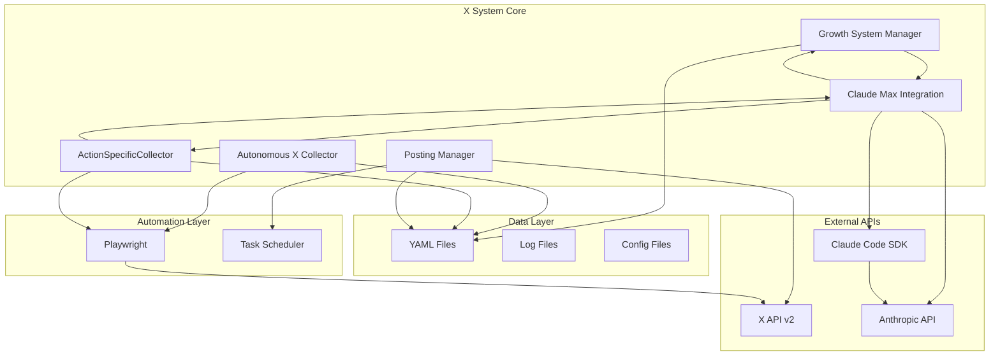
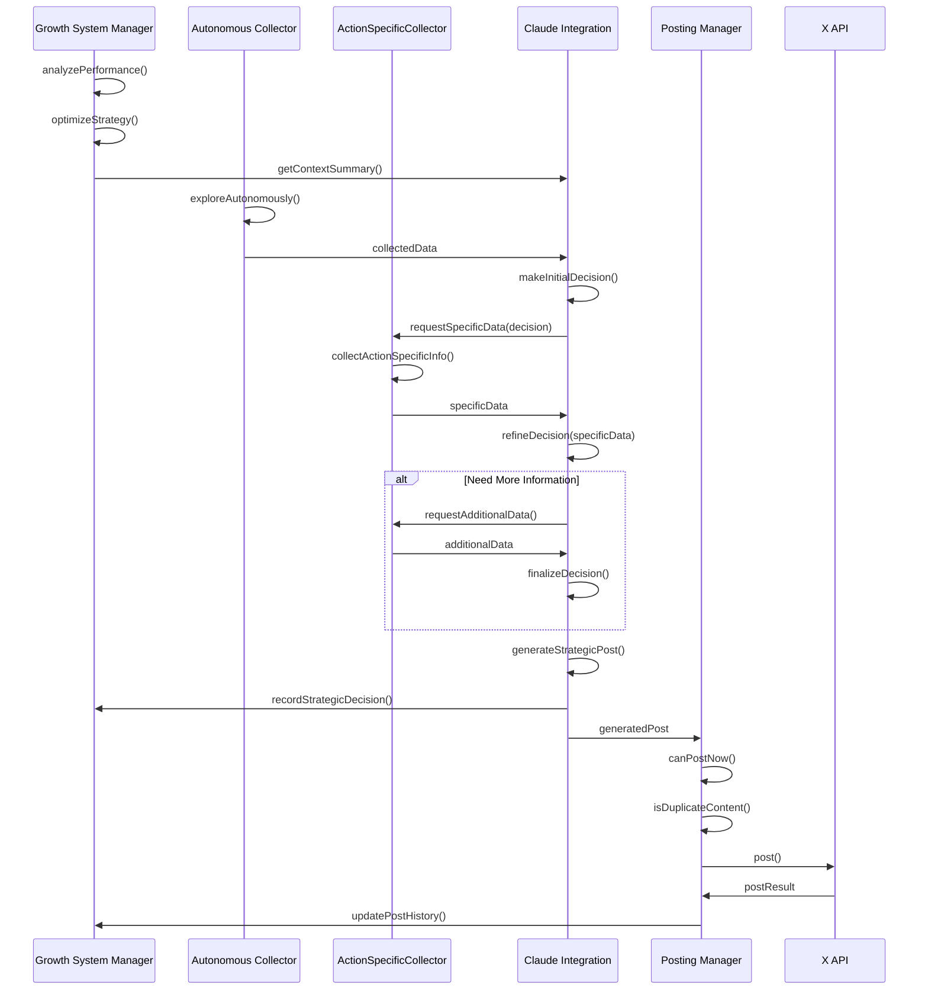
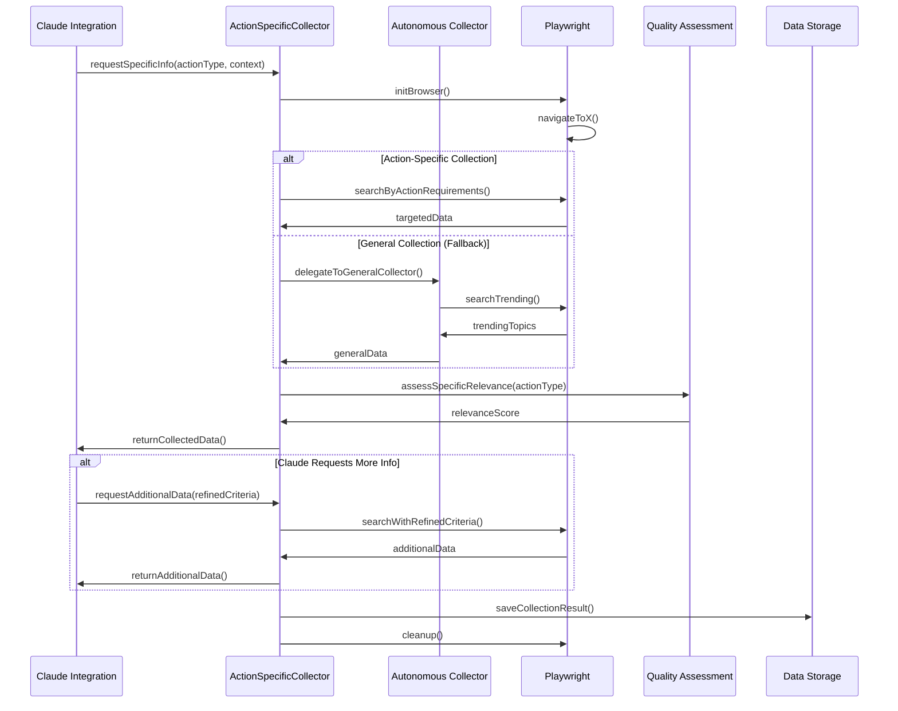
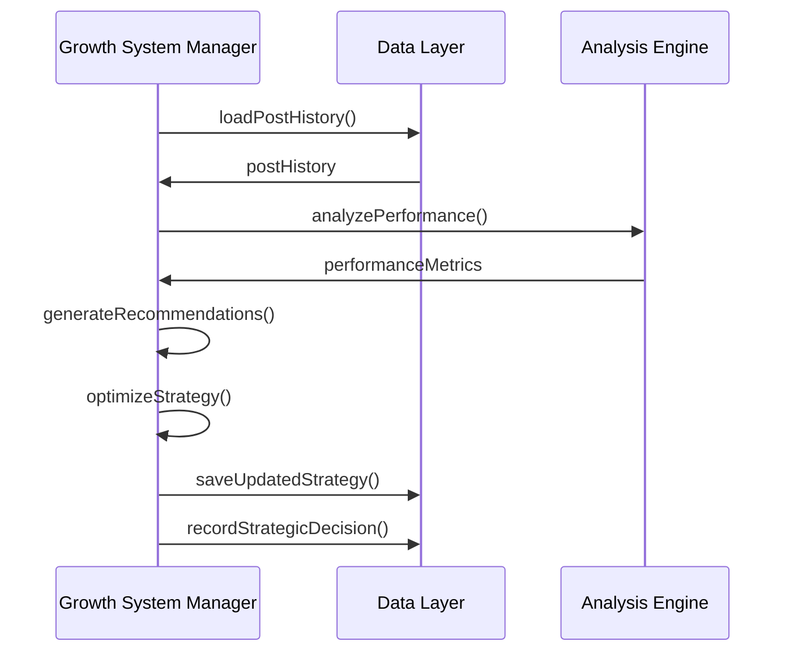
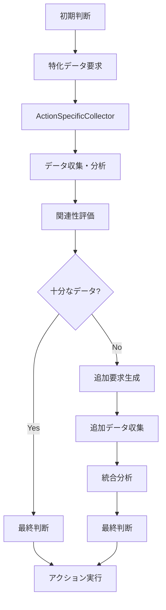

# X システムアーキテクチャ

## システム概要

X システムは、Xプラットフォーム（旧Twitter）上でのアカウント成長を管理するMVPシステムです。**ActionSpecificCollectorによるアクション特化型情報収集**と**連鎖判断エンジンによる自律的意思決定**を核とし、戦略的な投稿生成、動的情報探索、パフォーマンス分析を通じて、トレーディング教育コンテンツの価値ある発信を支援します。

### 新世代アーキテクチャの特徴
- **アクション特化型データ収集**: 実行予定のアクションに応じた特化情報の収集
- **連鎖判断システム**: 決定→収集→再判断→追加収集→実行の自律サイクル
- **Claude SDK ↔ Playwright連携**: AI判断とブラウザ自動化の連続的相互作用

## 主要機能

### 1. 戦略的成長管理
- **自動戦略調整**: パフォーマンス分析に基づく戦略の動的調整
- **成長目標管理**: フォロワー数、エンゲージメント率の目標設定と追跡
- **パフォーマンス分析**: 投稿履歴の分析と改善提案

### 2. 自律的情報探索（アクション特化型）
- **ActionSpecificCollector**: 実行決定に基づく特化情報収集
- **Playwright統合**: リアルタイムのトレンド情報収集
- **連鎖判断システム**: 収集→分析→再判断→追加収集の自律サイクル
- **品質評価システム**: 収集した情報の品質判定
- **コンテンツ分析**: 関連性・信頼性の自動評価

### 3. AI主導の投稿生成（連鎖判断型）
- **Claude Code SDK統合**: 戦略的コンテンツ生成
- **連鎖判断エンジン**: 決定→収集→再判断→実行の自律プロセス
- **品質管理**: 教育的価値の高い投稿の自動生成
- **コンテキスト最適化**: 成長戦略に基づくコンテンツ調整
- **動的情報統合**: ActionSpecificCollectorとの連携

### 4. 最適化された投稿スケジュール
- **1日15回投稿**: 最適化された投稿頻度
- **ゴールデンタイム集中**: 朝・昼・夕・夜の時間帯での戦略的投稿
- **重複防止**: 類似コンテンツの自動検出・回避

## システム構成

### 全体アーキテクチャ



### コンポーネント詳細

#### Growth System Manager
- **機能**: 戦略管理、パフォーマンス分析、目標追跡
- **役割**: アカウント成長の中核管理システム
- **実装**: TypeScriptクラス、YAML設定管理

#### Autonomous X Collector
- **機能**: 自律的情報探索、品質評価、トレンド分析
- **役割**: 外部情報の収集と品質管理
- **実装**: Playwright統合、非同期処理

#### ActionSpecificCollector
- **機能**: アクション特化型情報収集、連鎖判断支援、動的データ取得
- **役割**: 実行決定に基づく特化情報の収集と分析
- **実装**: Claude SDK連携、Playwright統合、リアルタイム分析

#### Claude Max Integration
- **機能**: 投稿生成、コンテキスト最適化、品質管理、連鎖判断エンジン
- **役割**: AI主導コンテンツ生成と自律判断プロセス
- **実装**: Claude Code SDK、フォールバック機能、ActionSpecificCollector連携

#### Posting Manager
- **機能**: スケジューリング、投稿実行、履歴管理
- **役割**: 投稿の実行と管理
- **実装**: X API統合、制限管理

## データフロー

### 投稿生成フロー（連鎖判断型）



### 情報収集フロー（アクション特化型）



### 戦略最適化フロー



## 連鎖判断アーキテクチャ詳細

### ActionSpecificCollector システム設計

#### 設計原則
1. **アクション特化収集**: 実行予定のアクションに応じた特化データ収集
2. **動的要件調整**: Claude SDKからの要求に基づく収集条件の動的変更
3. **品質最適化**: アクション関連性を重視した品質評価
4. **効率的リソース利用**: 必要最小限のデータ収集で最大効果

#### 実装アーキテクチャ
```typescript
class ActionSpecificCollector {
  private playwrightEngine: PlaywrightEngine;
  private claudeIntegration: ClaudeMaxIntegration;
  private qualityAssessment: QualityAssessment;
  
  // アクション特化収集のメインメソッド
  async collectForAction(
    actionType: ActionType,
    context: ActionContext
  ): Promise<ActionSpecificData> {
    // 1. アクションタイプに基づく収集戦略の決定
    const strategy = this.determineCollectionStrategy(actionType);
    
    // 2. Playwright使用の特化データ収集
    const rawData = await this.playwrightEngine.collectTargetedData(strategy);
    
    // 3. アクション関連性評価
    const relevanceScore = await this.assessActionRelevance(rawData, actionType);
    
    // 4. 構造化データ生成
    return this.structureActionData(rawData, relevanceScore, context);
  }
  
  // Claude SDKとの連鎖インタラクション
  async handleChainRequest(
    request: ChainRequest
  ): Promise<ChainResponse> {
    const data = await this.collectForAction(request.actionType, request.context);
    
    // Claude SDKに結果を送信し、追加要求をチェック
    const claudeResponse = await this.claudeIntegration.processCollectedData(data);
    
    if (claudeResponse.needsMoreData) {
      const additionalData = await this.collectAdditionalData(
        claudeResponse.additionalRequirements
      );
      return { data, additionalData, complete: true };
    }
    
    return { data, complete: true };
  }
}
```

### 連鎖判断エンジン

#### 判断フローアーキテクチャ


#### 連鎖判断ロジック
```typescript
class ChainDecisionEngine {
  async processDecisionChain(
    initialContext: SystemContext
  ): Promise<FinalDecision> {
    // フェーズ1: 初期判断
    const initialDecision = await this.makeInitialDecision(initialContext);
    
    // フェーズ2: 特化データ収集
    const specificData = await this.actionCollector.collectForAction(
      initialDecision.requiredActionType,
      initialDecision.context
    );
    
    // フェーズ3: 判断の精緻化
    const refinedDecision = await this.refineDecision(initialDecision, specificData);
    
    // フェーズ4: 追加データの必要性判定
    if (refinedDecision.confidence < this.confidenceThreshold) {
      const additionalData = await this.requestAdditionalData(refinedDecision);
      return this.finalizeDecision(refinedDecision, additionalData);
    }
    
    return this.finalizeDecision(refinedDecision);
  }
}
```

### 技術型定義（連鎖判断系）

#### ActionSpecificCollector インターフェース
```typescript
interface ActionSpecificCollector {
  // アクション特化データ収集
  collectForAction(
    actionType: ActionType,
    context: ActionContext,
    requirements: CollectionRequirements
  ): Promise<ActionSpecificData>;
  
  // 追加データ収集（連鎖判断用）
  collectAdditionalData(
    previousData: ActionSpecificData,
    refinedRequirements: RefinedRequirements
  ): Promise<AdditionalData>;
  
  // 収集データの関連性評価
  assessRelevance(
    data: ActionSpecificData,
    actionType: ActionType
  ): Promise<RelevanceScore>;
}

// アクション特化データ型
interface ActionSpecificData {
  actionType: ActionType;
  timestamp: number;
  data: Record<string, any>;
  relevanceScore: number;
  collectionMethod: CollectionMethod;
  context: ActionContext;
}

// 連鎖判断エンジン型
interface ChainDecisionEngine {
  makeInitialDecision(context: SystemContext): Promise<InitialDecision>;
  refineDecision(
    initialDecision: InitialDecision,
    specificData: ActionSpecificData
  ): Promise<RefinedDecision>;
  finalizeDecision(
    refinedDecision: RefinedDecision,
    additionalData?: AdditionalData
  ): Promise<FinalDecision>;
}

// アクションタイプ定義
type ActionType = 
  | 'trending_analysis'
  | 'competitor_research' 
  | 'market_sentiment'
  | 'educational_content'
  | 'engagement_optimization';
```

## 技術スタック

### コア技術

#### Node.js & TypeScript
- **Node.js**: >=18.0.0
- **TypeScript**: ^5.0.0
- **Target**: ES2022
- **Module**: CommonJS
- **Strict Mode**: 有効

#### 主要依存関係
- **@instantlyeasy/claude-code-sdk-ts**: Claude Code SDK統合
- **@anthropic-ai/sdk**: Anthropic API フォールバック
- **playwright**: ブラウザ自動化
- **typescript**: 型安全性確保

### 外部API統合

#### Claude Code SDK（連鎖判断機能統合）
```typescript
import { claude } from '@instantlyeasy/claude-code-sdk-ts';

// 連鎖判断用Claude統合
class ChainDecisionClaudeIntegration {
  async makeChainDecision(
    context: SystemContext,
    collectedData?: ActionSpecificData
  ): Promise<DecisionWithRequirements> {
    const prompt = this.buildChainDecisionPrompt(context, collectedData);
    
    const response = await claude()
      .withModel('opus')
      .query(prompt)
      .asStructured<DecisionWithRequirements>();
      
    return response;
  }
  
  // ActionSpecificCollectorとの連携
  async requestSpecificData(
    actionType: ActionType,
    requirements: CollectionRequirements
  ): Promise<ActionSpecificData> {
    return this.actionCollector.collectForAction(actionType, {
      requirements,
      priority: 'high',
      timeout: 120000
    });
  }
}
```

#### X API v2
```typescript
interface XClientConfig {
  apiKey: string;
  apiSecret: string;
  accessToken: string;
  accessTokenSecret: string;
}
```

#### Playwright（ActionSpecific統合）
```typescript
import { chromium, Page, Browser } from 'playwright';

// ActionSpecificCollector用Playwright統合
class ActionSpecificPlaywrightEngine {
  private browser: Browser | null = null;
  private page: Page | null = null;
  
  async collectTargetedData(
    strategy: CollectionStrategy
  ): Promise<RawCollectionData> {
    await this.initBrowser();
    
    switch (strategy.type) {
      case 'trending_analysis':
        return this.collectTrendingData(strategy.parameters);
      case 'competitor_research':
        return this.collectCompetitorData(strategy.parameters);
      case 'market_sentiment':
        return this.collectSentimentData(strategy.parameters);
      default:
        return this.collectGeneralData(strategy.parameters);
    }
  }
  
  private async initBrowser(): Promise<void> {
    if (!this.browser) {
      this.browser = await chromium.launch({
        headless: !testMode,
        args: ['--no-sandbox', '--disable-dev-shm-usage']
      });
      this.page = await this.browser.newPage();
    }
  }
}
```
```

### YAML駆動アーキテクチャ

#### 設計思想
- **人間中心設計**: 設定・データファイルは人間が読みやすく編集しやすいYAML形式
- **Claude Code SDK連携**: Claude Code SDKによる動的YAML操作の最適化
- **自己文書化**: コメント機能を活用した構造化データ
- **型安全性**: TypeScriptとの完全な型整合性

#### データファイル構造（連鎖判断系統合）
```
data/
├── account-strategy.yaml          # 成長戦略（ActionSpecific設定含む）
├── performance-insights.yaml      # パフォーマンス分析
├── growth-targets.yaml           # 成長目標
├── content-patterns.yaml         # コンテンツパターン
├── strategic-decisions.yaml      # 戦略的判断
├── posting-history.yaml          # 投稿履歴
├── collection-results.yaml       # 収集結果
└── quality-assessments.yaml      # 品質評価
```

### データ構造

#### アクション特化データ構造
```yaml
version: "1.0.0"
lastUpdated: 1705123456789
data:
  - id: "asc-1705123456789"
    actionType: "trending_analysis"
    timestamp: 1705123456789
    collectionMethod: "playwright_search"
    context:
      targetKeywords: ["BTC", "トレーディング"]
      timeRange: "1h"
      sourceTypes: ["trending_topics", "influencer_posts"]
    data:
      trends:
        - keyword: "BTC"
          volume: 1250
          sentiment: 0.65
        - keyword: "トレーディング"
          volume: 890
          sentiment: 0.72
    relevanceScore: 0.89
    qualityMetrics:
      dataFreshness: 0.95
      sourceCredibility: 0.85
      actionAlignment: 0.92
```

#### 連鎖判断履歴構造
```yaml
version: "1.0.0"
lastUpdated: 1705123456789
decisions:
  - id: "chain-1705123456789"
    timestamp: 1705123456789
    phases:
      initial:
        decision: "trending_analysis_required"
        confidence: 0.75
        reasoning: "市場動向を把握した投稿が必要"
      refinement:
        additionalDataRequested: true
        specificRequirements:
          - "BTC価格変動の詳細"
          - "投資家のセンチメント"
        confidence: 0.92
      final:
        action: "generate_market_analysis_post"
        confidence: 0.94
        execution: true
    totalProcessingTime: 125000  # ms
    dataSourcesUsed: ["trending_topics", "market_data", "social_sentiment"]
```

#### 投稿履歴
```yaml
- id: "1705123456789"
  content: "リスク管理の基本は、損失を限定することです。"
  timestamp: 1705123456789
  success: true
  likes: 15
  retweets: 3
  replies: 2
  views: 250
  quality: 8.5
  themes:
    - リスク管理
    - 基礎知識
```

#### 成長戦略（連鎖判断機能統合）
```yaml
version: "2.0.0"
lastUpdated: 1705123456789
currentPhase: growth
objectives:
  primary: "トレーディング教育コンテンツで信頼性のあるアカウントを構築"
  secondary:
    - "フォロワー数の安定的な増加"
    - "エンゲージメント率の向上"
    - "質の高いコミュニティ形成"
contentStrategy:
  themes:
    - "リスク管理"
    - "市場分析"
    - "投資心理"
    - "基礎知識"
  postingFrequency: 15
  optimalTimes:
    - "07:00"
    - "07:30"
    - "08:00"
    - "08:30"
    - "12:00"
    - "12:30"
    - "18:00"
    - "18:30"
    - "19:00"
    - "19:30"
    - "21:00"
    - "21:30"
    - "22:00"
    - "22:30"
    - "23:30"
actionSpecificSettings:
  collectionStrategies:
    trending_analysis:
      priority: high
      updateFrequency: "30m"
      dataSources: ["x_trending", "financial_news"]
      qualityThreshold: 0.8
      maxCollectionTime: 120000  # 2分
    competitor_research:
      priority: medium
      updateFrequency: "2h"
      dataSources: ["influencer_posts", "engagement_metrics"]
      qualityThreshold: 0.75
      maxCollectionTime: 180000  # 3分
    market_sentiment:
      priority: high
      updateFrequency: "1h"
      dataSources: ["market_data", "social_sentiment"]
      qualityThreshold: 0.85
      maxCollectionTime: 90000   # 1.5分
    educational_content:
      priority: medium
      updateFrequency: "4h"
      dataSources: ["educational_resources", "expert_insights"]
      qualityThreshold: 0.9
      maxCollectionTime: 150000  # 2.5分
    engagement_optimization:
      priority: low
      updateFrequency: "6h"
      dataSources: ["post_analytics", "user_interactions"]
      qualityThreshold: 0.7
      maxCollectionTime: 100000  # 1.67分
chainDecisionConfig:
  maxIterations: 3
  confidenceThreshold: 0.8
  dataRequirementThreshold: 0.7
  timeoutPerPhase: 120000      # 各フェーズのタイムアウト
  retryAttempts: 2
  fallbackToGeneral: true      # ActionSpecific失敗時のGeneral Collector使用
```

## セキュリティ設計

### 認証・認可

#### API キー管理
```typescript
// 環境変数による管理
const apiKeys = {
  claude: process.env.ANTHROPIC_API_KEY,
  xApi: process.env.X_API_KEY,
  xSecret: process.env.X_API_SECRET
};
```

#### 認証フロー
```typescript
// Claude Code SDK認証
const response = await claude()
  .withModel('opus')  // 自動認証
  .query(prompt);

// フォールバック認証
const anthropic = new Anthropic({
  apiKey: process.env.ANTHROPIC_API_KEY
});
```

### データ保護

#### 機密データ処理
```typescript
// 機密データの除外
const sanitizedData = {
  ...data,
  apiKey: undefined,
  secrets: undefined
};
```

#### ログ保護
```typescript
// 機密情報のマスク
console.log(`API Key: ${apiKey.slice(0, 8)}...`);
```

## パフォーマンス最適化

### 非同期処理

#### 並列処理
```typescript
// 並列実行
const [performance, strategy, targets] = await Promise.all([
  this.analyzePerformance(postHistory),
  this.optimizeStrategy(),
  this.updateTargets()
]);
```

#### 逐次処理
```typescript
// 依存関係がある場合の逐次処理
const analysis = await this.analyzePerformance(postHistory);
const updates = await this.optimizeStrategy(analysis);
const result = await this.applyUpdates(updates);
```

### リソース管理

#### メモリ最適化
```typescript
// 最新20件のみ保持
if (this.decisions.length > 20) {
  this.decisions = this.decisions.slice(-20);
}
```

#### ブラウザリソース管理
```typescript
// 適切なクリーンアップ
private async cleanup(): Promise<void> {
  if (this.browser) {
    await this.browser.close();
    this.browser = null;
    this.page = null;
  }
}
```

### 品質管理

#### 品質評価システム
```typescript
interface QualityAssessment {
  score: number;  // 0.0-1.0
  factors: {
    engagement: number;   // エンゲージメント評価
    relevance: number;    // 関連性評価
    credibility: number;  // 信頼性評価
    uniqueness: number;   // 独自性評価
  };
  reasoning: string;
}
```

#### 投稿制限管理
```typescript
function canPostNow(): { allowed: boolean; reason?: string } {
  // 最小間隔チェック（30分）
  if (timeSinceLastPost < 30 * 60 * 1000) {
    return { allowed: false, reason: '最小間隔未達' };
  }
  
  // 日次制限チェック（15回/日）
  if (postsInLastDay >= 15) {
    return { allowed: false, reason: '日次制限超過' };
  }
  
  return { allowed: true };
}
```

## 監視・ログ

### ログ戦略

#### 構造化ログ
```typescript
// 戦略的判断記録
logger.info('Strategic decision recorded', {
  type: 'content_adjustment',
  confidence: 0.85,
  timestamp: Date.now()
});
```

#### パフォーマンスメトリクス
```typescript
interface PerformanceMetrics {
  apiResponseTime: number;
  postSuccessRate: number;
  qualityScore: number;
  systemUptime: number;
}
```

### 品質チェック

#### 投稿品質評価
- **文字数**: 280文字以内
- **教育的価値**: 高い教育的価値
- **リスク情報**: 適切なリスク開示
- **ブランド安全性**: 不適切内容の回避

#### 重複防止
```typescript
function isDuplicateContent(content: string): boolean {
  const similarity = calculateSimilarity(content, recentPosts);
  return similarity > 0.8;  // 80%以上の類似度で重複判定
}
```

## 設計原則

### MVP準拠設計

#### 機能制約
- **統計システム禁止**: 複雑な統計分析は実装しない
- **高度エラーハンドリング禁止**: シンプルなエラー処理のみ
- **将来拡張機能禁止**: 現在必要な機能のみ実装

#### 実装例
```typescript
// ✅ MVP準拠: シンプルな成長率計算
private calculateGrowthRate(currentValue: number): number {
  return Math.max(0, currentValue * 0.1);
}

// ❌ MVP違反: 複雑な統計分析
// private calculateComplexStatistics(data: any[]): ComplexStats { ... }
```

### 可読性優先

#### コード構造
```typescript
// 明確な命名
class GrowthSystemManager {
  // 明確なメソッド名
  async analyzePerformance(postHistory: PostHistory[]): Promise<void>
  async optimizeStrategy(): Promise<GrowthSystemUpdate[]>
  
  // 明確な変数名
  private system: AutonomousGrowthSystem;
  private dataDir: string;
}
```

### 保守性重視

#### モジュール分離
```
x/src/
├── lib/
│   ├── growth-system-manager.ts    # 成長システム管理
│   ├── autonomous-x-collector.ts   # 自律収集
│   ├── claude-max-integration.ts   # Claude統合
│   └── posting-manager.ts          # 投稿管理
├── types/
│   ├── growth-system.ts           # 成長システム型
│   ├── autonomous.ts              # 自律収集型
│   └── index.ts                   # 共通型
└── data/
    └── account-strategy.yaml      # 統合設定（systemConfig + contentTemplates含む）
```

## 投稿スケジュール

### ゴールデンタイム集中投稿（15回/日）

#### 投稿時間配分
```yaml
optimalTimes:
  # 朝の通勤時間帯（4回）
  - "07:00"
  - "07:30"
  - "08:00"
  - "08:30"
  # 昼休み時間帯（2回）
  - "12:00"
  - "12:30"
  # 夕方の帰宅時間帯（4回）
  - "18:00"
  - "18:30"
  - "19:00"
  - "19:30"
  # 夜のリラックスタイム（4回）
  - "21:00"
  - "21:30"
  - "22:00"
  - "22:30"
  # 深夜トレーダー向け（1回）
  - "23:30"
```

#### 時間帯別エンゲージメント戦略
- **朝の通勤時間帯**: 市場開始前の準備情報
- **昼休み時間帯**: 軽めの教育コンテンツ
- **夕方の帰宅時間帯**: 1日の市場総括
- **夜のリラックスタイム**: 深い分析・教育コンテンツ
- **深夜枠**: 海外市場情報、翌日の準備

## コンテキスト管理とハレーシネーション防止

本システムでは、Claude Code SDKの効率的な活用のため、高度なコンテキスト管理システムを実装しています。大量のコンテキストはハレーシネーション（幻覚）を引き起こす可能性があるため、以下の仕組みで管理しています。

### コンテキスト管理アーキテクチャ

#### 設計原則
1. **コンテキスト分散**: 重たい処理を複数のClaude Code SDKインスタンスに分割
2. **ハレーシネーション防止**: コンテキスト上限管理と自動クリーンアップ
3. **効率的な状態管理**: 中間結果のファイルベース共有

#### 主要コンポーネント

##### Context Manager (`context-manager.ts`)
```typescript
class ContextManager {
  // 中間結果の保存（24時間で自動期限切れ）
  async saveIntermediateResult(taskId: string, result: any): Promise<string>
  
  // コンテキストスナップショット
  async saveContextSnapshot(
    taskId: string,
    state: Record<string, any>,
    checkpoint: string,
    progress: number
  ): Promise<void>
  
  // 古いコンテキストの自動削除
  async cleanupOldContexts(maxAgeMs: number): Promise<void>
}
```

##### Parallel Execution Manager (`parallel-execution-manager.ts`)
- **タスクグループ化**: 優先度別に並列実行グループを作成
- **実行戦略**: all（全完了待ち）、race（最速採用）、settled（成否問わず完了）
- **タイムアウト管理**: 各タスクに個別タイムアウト設定

##### Long Running Task Manager (`long-running-task-manager.ts`)
- **自動分割**: 長時間タスクを最大2分のサブタスクに分割
- **チェックポイント**: 中断からの再開をサポート
- **進捗追跡**: リアルタイムの進捗率更新

##### Async Execution Manager (`async-execution-manager.ts`)
- **非同期ハンドル管理**: 実行中タスクのMapベース管理
- **バッチ実行**: 複数タスクの効率的な並列実行
- **自動クリーンアップ**: 完了タスクの定期削除

### 実装パターン

#### タスク分割パターン
```typescript
// 長時間の分析タスクを4つのフェーズに分割
const analysisPhases = ['データ準備', '基本分析', '詳細分析', '結果統合'];
for (let i = 0; i < analysisPhases.length; i++) {
  subtasks.push({
    id: `${task.id}-subtask-${i}`,
    name: `${task.name} - ${analysisPhases[i]}`,
    timeout: 120000 // 2分以内
  });
}
```

#### 中間結果共有パターン
```typescript
// タスクAの結果を保存
await contextManager.saveIntermediateResult(
  'collect-task-1',
  collectionResult,
  'collection_completed'
);

// タスクBで結果を読み込み
const collectionData = await contextManager.loadLatestResult('collect-task-1');
```

### ベストプラクティス

#### コンテキストサイズ管理
- **推奨上限**: 1タスクあたり最大10,000トークン相当
- **分割基準**: 推定実行時間が5分を超える場合は分割
- **並列度**: 最大3-5個の並列タスク

#### データ永続化
- **保存形式**: YAML形式で`data/`ディレクトリに保存
- **命名規則**: `{type}-{taskId}-{timestamp}.yaml`
- **保持期間**: 24時間（自動削除）

#### エラーハンドリング
- **タイムアウト**: 各サブタスクに2分のタイムアウト設定
- **リトライ**: 失敗時のチェックポイントからの再開
- **フォールバック**: 並列実行失敗時の順次実行

### ディレクトリ構造
```
data/
├── contexts/      # コンテキストスナップショット
├── status/        # タスクステータス
├── intermediate/  # 中間結果
└── communication/ # Claude間通信データ
```

## 制約と注意事項

### システム制約
- **投稿頻度**: 1日15回上限
- **最小間隔**: 30分間隔
- **品質スコア**: 7.0以上必須
- **重複判定**: 80%以上の類似度で重複

### 運用制約
- **API制限**: X API v2の制限準拠
- **品質管理**: 投稿前の品質チェック必須
- **監視**: リアルタイム監視とログ管理
- **バックアップ**: 日次データバックアップ

### 技術制約
- **Node.js**: 18.0.0以上必須
- **TypeScript**: strict mode有効
- **メモリ**: 最大2GB使用
- **ディスク**: 100MB以上の空き容量

---

**注意**: このアーキテクチャはMVP原則に基づいて設計されており、複雑な機能は意図的に排除されています。システムは教育・情報提供を目的としており、投資助言を行うものではありません。