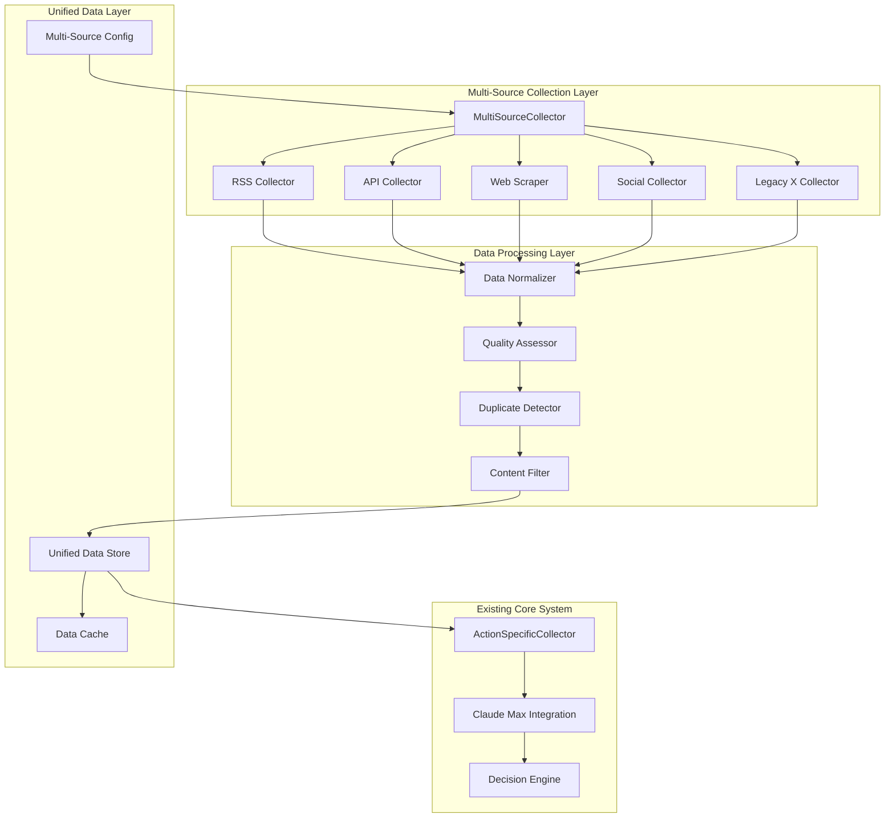

# 多様情報源対応アーキテクチャ設計書

**Project**: TradingAssistantX 多様情報源対応  
**Manager**: Claude Code Manager  
**Version**: v2.0  
**Date**: 2025-01-21  

## 🏗️ **システムアーキテクチャ概要**

既存のX特化システムを拡張し、RSS、API、Webスクレイピング等の多様な情報源に対応した統合情報収集システムに発展させる。

### 設計原則
1. **既存システム継承**: ActionSpecificCollector、Claude SDK連携を維持
2. **段階的移行**: X機能を残しながら新機能を追加
3. **YAML駆動継続**: 設定ファイル方式の継続
4. **品質最優先**: 情報品質とシステム安定性の確保

## 🔄 **新旧システム統合アーキテクチャ**

### 全体システム構成図



## 📋 **コンポーネント詳細設計**

### 1. **MultiSourceCollector** (新規)

```typescript
export class MultiSourceCollector {
  private rssCollector: RSSCollector;
  private apiCollector: APICollector;
  private webScraper: WebScraper;
  private socialCollector: SocialCollector;
  private legacyCollector: LegacyXCollector;
  
  constructor(config: MultiSourceConfig) {
    this.initializeCollectors(config);
  }
  
  // 統合収集メソッド
  async collectFromAllSources(
    requirements: CollectionRequirements
  ): Promise<CollectedData[]> {
    const collections = await Promise.allSettled([
      this.rssCollector.collect(requirements.rss),
      this.apiCollector.collect(requirements.api),
      this.webScraper.collect(requirements.web),
      this.socialCollector.collect(requirements.social),
      this.legacyCollector.collect(requirements.legacy) // 既存X収集
    ]);
    
    return this.processCollectionResults(collections);
  }
  
  // 優先度付き収集（緊急時）
  async collectPrioritized(
    priority: 'high' | 'medium' | 'low'
  ): Promise<CollectedData[]> {
    const sources = this.getSources

    return this.executePrioritizedCollection(sources);
  }
}
```

### 2. **RSSCollector** (新規)

```typescript
export class RSSCollector implements DataCollector {
  private parser: RSSParser;
  private config: RSSConfig;
  
  async collect(requirements: RSSRequirements): Promise<RSSData[]> {
    const feeds = this.selectFeeds(requirements);
    const results: RSSData[] = [];
    
    for (const feed of feeds) {
      try {
        const parsed = await this.parser.parseURL(feed.url);
        const filtered = this.filterByQuality(parsed.items, feed.qualityThreshold);
        const normalized = this.normalizeRSSData(filtered, feed);
        
        results.push(...normalized);
      } catch (error) {
        console.error(`RSS collection failed for ${feed.name}:`, error);
        // Continue with other feeds
      }
    }
    
    return results;
  }
  
  private filterByQuality(items: any[], threshold: number): any[] {
    return items.filter(item => {
      const quality = this.calculateRSSQuality(item);
      return quality >= threshold;
    });
  }
  
  private calculateRSSQuality(item: any): number {
    let score = 0;
    
    // Content length check
    if (item.contentSnippet?.length > 100) score += 0.3;
    
    // Freshness check (within 24 hours)
    const age = Date.now() - new Date(item.pubDate).getTime();
    if (age < 24 * 60 * 60 * 1000) score += 0.3;
    
    // Title quality check
    if (this.hasFinancialKeywords(item.title)) score += 0.4;
    
    return Math.min(score, 1.0);
  }
}
```

### 3. **APICollector** (新規)

```typescript
export class APICollector implements DataCollector {
  private rateLimiter: RateLimiterFlexible;
  private apiClients: Map<string, APIClient>;
  
  constructor(config: APIConfig) {
    this.initializeClients(config);
    this.rateLimiter = new RateLimiterFlexible({
      keyPrefix: 'api_collector',
      points: config.maxRequestsPerHour,
      duration: 3600, // 1 hour
    });
  }
  
  async collect(requirements: APIRequirements): Promise<APIData[]> {
    const results: APIData[] = [];
    
    for (const apiConfig of requirements.apis) {
      try {
        await this.rateLimiter.consume(apiConfig.name);
        
        const client = this.apiClients.get(apiConfig.name);
        const data = await client.fetchData(apiConfig.query);
        const normalized = this.normalizeAPIData(data, apiConfig);
        
        results.push(...normalized);
      } catch (rateLimitError) {
        console.warn(`Rate limit hit for ${apiConfig.name}, skipping`);
      }
    }
    
    return results;
  }
  
  // NewsAPI統合例
  async collectFromNewsAPI(query: NewsQuery): Promise<APIData[]> {
    const client = this.apiClients.get('newsapi');
    const response = await client.request({
      endpoint: '/everything',
      params: {
        q: query.keywords.join(' OR '),
        sortBy: 'publishedAt',
        language: 'en',
        pageSize: 20
      }
    });
    
    return this.normalizeNewsAPIResponse(response.articles);
  }
}
```

### 4. **WebScraper** (Playwright拡張)

```typescript
export class WebScraper implements DataCollector {
  private browserManager: PlaywrightBrowserManager; // 既存システム活用
  private robotsChecker: RobotsChecker;
  
  async collect(requirements: WebScrapingRequirements): Promise<WebData[]> {
    const results: WebData[] = [];
    
    for (const target of requirements.targets) {
      // robots.txt チェック
      if (!(await this.robotsChecker.isAllowed(target.url))) {
        console.warn(`Scraping not allowed for ${target.url}`);
        continue;
      }
      
      try {
        const data = await this.scrapeWebsite(target);
        results.push(...data);
      } catch (error) {
        console.error(`Scraping failed for ${target.url}:`, error);
      }
    }
    
    return results;
  }
  
  private async scrapeWebsite(target: WebTarget): Promise<WebData[]> {
    const browser = await this.browserManager.getBrowser();
    const page = await browser.newPage();
    
    try {
      await page.goto(target.url, { waitUntil: 'networkidle' });
      
      // 動的コンテンツの読み込み待機
      if (target.waitForSelector) {
        await page.waitForSelector(target.waitForSelector, { timeout: 10000 });
      }
      
      // データ抽出
      const extractedData = await page.evaluate((selectors) => {
        const title = document.querySelector(selectors.title)?.textContent;
        const content = document.querySelector(selectors.content)?.textContent;
        const publishedAt = document.querySelector(selectors.date)?.textContent;
        
        return { title, content, publishedAt };
      }, target.selectors);
      
      return [this.normalizeWebData(extractedData, target)];
    } finally {
      await page.close();
    }
  }
}
```

### 5. **データ正規化・統合システム**

```typescript
export class DataNormalizer {
  // 異なる情報源からのデータを統一形式に変換
  normalize(rawData: any, source: DataSource): NormalizedData {
    switch (source.type) {
      case 'rss':
        return this.normalizeRSSData(rawData, source);
      case 'api':
        return this.normalizeAPIData(rawData, source);
      case 'web':
        return this.normalizeWebData(rawData, source);
      case 'social':
        return this.normalizeSocialData(rawData, source);
      case 'legacy_x':
        return this.normalizeLegacyXData(rawData, source); // 既存システム互換
      default:
        throw new Error(`Unknown source type: ${source.type}`);
    }
  }
  
  // 品質スコア統一計算
  calculateQualityScore(data: NormalizedData): number {
    const weights = {
      contentRelevance: 0.3,
      sourceCredibility: 0.25,
      timelinessScore: 0.2,
      uniquenessScore: 0.15,
      readabilityScore: 0.1
    };
    
    return Object.entries(weights).reduce((score, [metric, weight]) => {
      return score + (data.qualityMetrics[metric] * weight);
    }, 0);
  }
}

export class DuplicateDetector {
  private threshold = 0.85; // 85%以上の類似度で重複判定
  
  detectDuplicates(dataList: NormalizedData[]): NormalizedData[] {
    const uniqueData: NormalizedData[] = [];
    
    for (const item of dataList) {
      if (!this.isDuplicate(item, uniqueData)) {
        uniqueData.push(item);
      }
    }
    
    return uniqueData;
  }
  
  private isDuplicate(item: NormalizedData, existingData: NormalizedData[]): boolean {
    for (const existing of existingData) {
      const similarity = this.calculateSimilarity(item.content, existing.content);
      if (similarity >= this.threshold) {
        return true;
      }
    }
    return false;
  }
  
  private calculateSimilarity(text1: string, text2: string): number {
    // Jaccard類似度計算
    const set1 = new Set(text1.toLowerCase().split(/\s+/));
    const set2 = new Set(text2.toLowerCase().split(/\s+/));
    
    const intersection = new Set([...set1].filter(x => set2.has(x)));
    const union = new Set([...set1, ...set2]);
    
    return intersection.size / union.size;
  }
}
```

## 📊 **設定ファイル構造**

### 多様情報源設定 (`data/multi-source-config.yaml`)

```yaml
version: "2.0.0"
lastUpdated: "2025-01-21T10:00:00Z"

# 全般設定
global:
  enabled: true
  fallbackToLegacy: true  # X システムをフォールバックとして使用
  maxConcurrentSources: 5
  collectionTimeout: 300  # 5分でタイムアウト
  qualityThreshold: 0.7

# RSS フィード設定
rss:
  enabled: true
  updateInterval: 30  # 30分間隔
  maxFeedsPerCycle: 10
  sources:
    - name: "bloomberg-markets"
      url: "https://feeds.bloomberg.com/markets/news.rss"
      category: "financial_news"
      priority: "high"
      qualityThreshold: 0.8
      tags: ["bloomberg", "markets", "news"]
      
    - name: "reuters-finance"
      url: "https://feeds.reuters.com/news/wealth"
      category: "financial_news"
      priority: "high"
      qualityThreshold: 0.8
      tags: ["reuters", "finance", "wealth"]
      
    - name: "investopedia-education"
      url: "https://www.investopedia.com/feedbuilder/feed/getfeed"
      category: "educational"
      priority: "medium"
      qualityThreshold: 0.75
      tags: ["investopedia", "education", "trading"]

# API 設定
apis:
  enabled: true
  rateLimitStrategy: "adaptive"
  maxRequestsPerHour: 1000
  sources:
    - name: "newsapi"
      type: "news_aggregator"
      endpoint: "https://newsapi.org/v2/everything"
      apiKeyEnv: "NEWSAPI_KEY"
      category: "general_news"
      priority: "high"
      requestLimit: 100  # per hour
      queryTemplates:
        - "trading AND (stocks OR forex)"
        - "investment AND education"
        - "financial AND markets"
        
    - name: "alpha_vantage"
      type: "financial_data"
      endpoint: "https://www.alphavantage.co/query"
      apiKeyEnv: "ALPHA_VANTAGE_KEY"
      category: "market_data"
      priority: "medium"
      requestLimit: 25   # per hour (free tier)

# Web スクレイピング設定
webScraping:
  enabled: true
  respectRobots: true
  maxConcurrent: 3
  defaultTimeout: 30
  sources:
    - name: "yahoo-finance"
      baseUrl: "https://finance.yahoo.com"
      category: "financial_news"
      priority: "high"
      selectors:
        title: "h1[data-module=ArticleHeader]"
        content: ".caas-body"
        date: ".caas-attr-meta-time"
      updateInterval: 60  # 1時間間隔
      
    - name: "marketwatch"
      baseUrl: "https://www.marketwatch.com"
      category: "market_analysis"
      priority: "medium"
      selectors:
        title: ".article__headline"
        content: ".article__body"
        date: ".article__timestamp"
      updateInterval: 90

# ソーシャルメディア設定（将来拡張）
social:
  enabled: false  # 段階的に有効化
  sources:
    - name: "reddit-investing"
      platform: "reddit"
      subreddit: "investing"
      priority: "low"
      postLimit: 10
      qualityThreshold: 0.6

# レガシーX システム設定（既存継続）
legacy_x:
  enabled: true  # フォールバックとして継続使用
  priority: "medium"
  useAsBackup: true
  config:
    # 既存のActionSpecificCollector設定を継承
    testMode: true
    collectionStrategy: "fallback"
```

## 🔄 **既存システムとの統合ポイント**

### ActionSpecificCollector統合

```typescript
// 既存のActionSpecificCollectorを拡張
export class EnhancedActionSpecificCollector extends ActionSpecificCollector {
  private multiSourceCollector: MultiSourceCollector;
  
  constructor(
    playwrightEngine: PlaywrightEngine,
    multiSourceCollector: MultiSourceCollector
  ) {
    super(playwrightEngine);
    this.multiSourceCollector = multiSourceCollector;
  }
  
  // 既存メソッドを拡張
  async collectForAction(
    actionType: ActionType,
    context: ActionContext,
    sufficiencyTarget: number = 85
  ): Promise<ActionSpecificResult> {
    console.log('🔄 [Enhanced Collection] 多様情報源から収集開始...');
    
    try {
      // 1. 多様情報源から収集
      const multiSourceData = await this.multiSourceCollector.collectFromAllSources({
        actionType,
        context,
        priority: this.determinePriority(actionType)
      });
      
      if (this.isSufficient(multiSourceData, sufficiencyTarget)) {
        return this.formatResult(multiSourceData, 'multi_source');
      }
      
      // 2. 不十分な場合は既存のX収集をフォールバック
      console.log('⚠️ [Fallback] 多様情報源が不十分、X収集にフォールバック');
      const legacyResult = await super.collectForAction(actionType, context, sufficiencyTarget);
      
      // 3. 結果を統合
      return this.mergeResults(multiSourceData, legacyResult);
      
    } catch (error) {
      console.error('❌ [Enhanced Collection Error]:', error);
      // エラー時は完全に既存システムにフォールバック
      return super.collectForAction(actionType, context, sufficiencyTarget);
    }
  }
}
```

### Claude Max Integration拡張

```typescript
// 多様情報源対応のプロンプト拡張
export class EnhancedClaudeMaxIntegration extends ClaudeMaxIntegration {
  
  async generateStrategicPost(): Promise<GeneratedPost> {
    // 既存のプロンプトに情報源多様性を追加
    const enhancedPrompt = `
      あなたはトレーディングコミュニティ向けの価値あるコンテンツを生成するAIアシスタントです。
      
      ## 利用可能な情報源
      1. RSS フィード（Bloomberg, Reuters, Investopedia等）
      2. 公開API（NewsAPI, Alpha Vantage等）
      3. Web スクレイピング（Yahoo Finance, MarketWatch等）
      4. レガシーX データ（フォールバック用）
      
      ## タスク
      上記の多様な情報源から最新データを統合し、教育的な投稿内容を生成してください。
      
      ## 注意事項
      - 複数情報源の内容を組み合わせた付加価値のあるコンテンツ
      - 情報源の信頼性を考慮した内容
      - X以外の情報源を積極的に活用
      
      価値ある統合投稿を生成してください。
    `;
    
    return super.generateWithEnhancedPrompt(enhancedPrompt);
  }
}
```

## 📈 **パフォーマンス最適化戦略**

### 1. 並列処理最適化

```typescript
export class ParallelCollectionManager {
  private maxConcurrency = 5;
  private collectionQueue: Queue<CollectionTask> = new Queue();
  
  async executeParallelCollection(tasks: CollectionTask[]): Promise<CollectedData[]> {
    const batches = this.createBatches(tasks, this.maxConcurrency);
    const results: CollectedData[] = [];
    
    for (const batch of batches) {
      const batchResults = await Promise.allSettled(
        batch.map(task => this.executeTask(task))
      );
      
      results.push(...this.processBatchResults(batchResults));
    }
    
    return results;
  }
}
```

### 2. キャッシュ戦略

```typescript
export class DataCacheManager {
  private cache = new Map<string, CachedData>();
  private maxCacheAge = 30 * 60 * 1000; // 30分
  
  async getCachedOrFetch(
    key: string, 
    fetcher: () => Promise<CollectedData[]>
  ): Promise<CollectedData[]> {
    const cached = this.cache.get(key);
    
    if (cached && !this.isExpired(cached)) {
      console.log(`📄 [Cache Hit] ${key}`);
      return cached.data;
    }
    
    console.log(`🔄 [Cache Miss] ${key} - fetching fresh data`);
    const freshData = await fetcher();
    
    this.cache.set(key, {
      data: freshData,
      timestamp: Date.now()
    });
    
    return freshData;
  }
}
```

## 🧪 **テスト戦略**

### 統合テスト設計

```typescript
describe('Multi-Source Collection Integration', () => {
  let multiSourceCollector: MultiSourceCollector;
  let mockConfig: MultiSourceConfig;
  
  beforeEach(() => {
    // テスト用設定でコレクターを初期化
    mockConfig = createTestConfig();
    multiSourceCollector = new MultiSourceCollector(mockConfig);
  });
  
  test('should collect from RSS feeds successfully', async () => {
    const requirements = createRSSRequirements();
    const results = await multiSourceCollector.collectFromRSS(requirements);
    
    expect(results).toBeDefined();
    expect(results.length).toBeGreaterThan(0);
    expect(results[0].source).toBe('rss');
  });
  
  test('should fallback to legacy X collector on failure', async () => {
    // RSS/API収集を意図的に失敗させる
    jest.spyOn(multiSourceCollector, 'collectFromAllSources')
        .mockRejectedValue(new Error('Collection failed'));
    
    const results = await multiSourceCollector.collectPrioritized('high');
    
    // レガシーシステムから結果が得られることを確認
    expect(results).toBeDefined();
    expect(results.some(r => r.source === 'legacy_x')).toBe(true);
  });
});
```

## 🚀 **実装ロードマップ**

### Phase 1: 基盤構築 (Week 1)
- [ ] `MultiSourceCollector` 基本実装
- [ ] `DataNormalizer` システム構築
- [ ] 設定ファイル構造定義
- [ ] 基本的な統合テスト

### Phase 2: RSS/API統合 (Week 2)
- [ ] `RSSCollector` 完全実装
- [ ] `APICollector` 完全実装
- [ ] NewsAPI, Yahoo Finance API統合
- [ ] 品質評価システム

### Phase 3: Web拡張 (Week 3)
- [ ] `WebScraper` 多サイト対応
- [ ] robots.txt遵守システム
- [ ] パフォーマンス最適化
- [ ] エラーハンドリング強化

### Phase 4: システム統合 (Week 4)
- [ ] 既存システムとの完全統合
- [ ] フォールバック機能完成
- [ ] 監視・メトリクス追加
- [ ] ドキュメント更新

---

**Ready for Implementation**: この設計に基づき、3名のワーカーへのタスク配分を行います。